# NeuronskeMreze-vizdoom

YOLO-style enemy detector trained on Freedoom 2 gameplay frames. The headline tool is `compare.py`, a spectator-mode viewer that overlays engine ground-truth boxes (green) against model predictions (cyan) so you can see what the network actually learned.

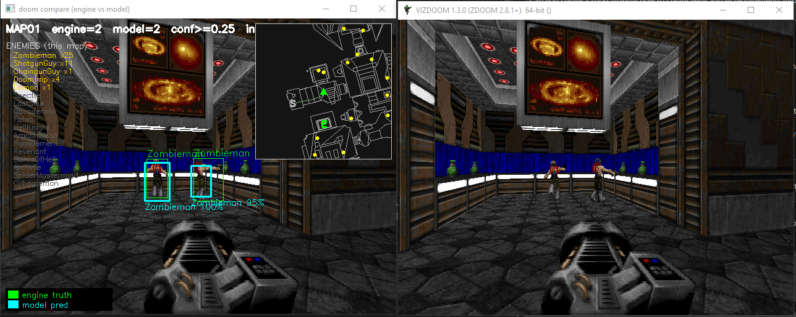

*Left: `compare.py` showing MAP01 with two Zombiemen detected at 100% and 95% confidence, plus engine ground-truth boxes, enemy roster, and rotating minimap. Right: the unmodified ViZDoom window.*

## The dataset

**33,737 frames** captured across **32 Freedoom 2 maps**, labeled with **17 enemy
classes** using ViZDoom's engine-perfect bounding boxes (no manual annotation).
The split is **by map** — train, validation, and test come from entirely
different maps — so the model is always evaluated on environments it has never seen.

### The 17 enemy classes

Each class with its in-game **attack sprite**, the class ID baked into the
labels, total **placements** across all maps, and how many **maps** it appears in:

| Sprite | ID | Class | Placed | In maps |
|:---:|---:|---|---:|---:|
| 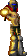 | 0 | Zombieman | 834 | 29 |
| 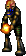 | 1 | ShotgunGuy | 756 | 29 |
| 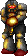 | 2 | ChaingunGuy | 403 | 28 |
| 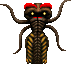 | 3 | DoomImp | 1,275 | 32 |
|  | 4 | Demon | 341 | 30 |
| 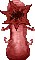 | 5 | Spectre | 209 | 26 |
| 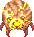 | 6 | LostSoul | 211 | 19 |
| 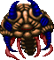 | 7 | Cacodemon | 245 | 22 |
| 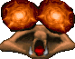 | 8 | Fatso | 85 | 17 |
| 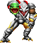 | 9 | HellKnight | 212 | 24 |
| 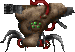 | 10 | Arachnotron | 69 | 18 |
| 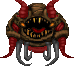 | 11 | PainElemental | 38 | 14 |
| 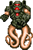 | 12 | Revenant | 253 | 23 |
| 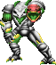 | 13 | BaronOfHell | 92 | 21 |
| 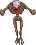 | 14 | Archvile | 64 | 19 |
| 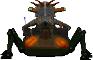 | 15 | SpiderMastermind | 5 | 4 |
| 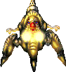 | 16 | Cyberdemon | 18 | 11 |

Two things this table foreshadows: **Demon and Spectre (IDs 4 & 5) use the
identical sprite** — the Spectre is only distinguished at runtime by
semi-transparency, which is why it's nearly impossible to detect from a single
frame. And the counts are wildly **imbalanced** — DoomImp appears in all 32 maps
with 1,275 placements, while SpiderMastermind has just 5 across 4 maps.

### Per-map breakdown

32 maps, 33,737 frames. Each row lists that map's enemies **in class-ID order**,
as **attack sprite Name placements (frames seen)**: how many the level designer
placed, and how many captured frames the enemy actually appears in. Split:
train = MAP01-15 + MAP31, val = MAP16-25, test = MAP26-30 + MAP32.

| Map | Split | Frames | Enemies — placements (frames seen) |
|---|---|---:|---|
| MAP01 | train | 111 |  Zombieman 25 (57)<br> ShotgunGuy 11 (27)<br> ChaingunGuy 1 (0)<br> DoomImp 4 (40)<br> Demon 1 (0) |
| MAP02 | train | 312 |  Zombieman 17 (40)<br> ShotgunGuy 11 (44)<br> DoomImp 21 (145)<br> Demon 15 (56)<br> Spectre 9 (57) |
| MAP03 | train | 434 |  Zombieman 45 (104)<br> ShotgunGuy 21 (70)<br> ChaingunGuy 13 (5)<br> DoomImp 44 (235)<br> Demon 17 (10)<br> Spectre 7 (75) |
| MAP04 | train | 596 |  Zombieman 25 (138)<br> ShotgunGuy 40 (130)<br> ChaingunGuy 15 (31)<br> DoomImp 29 (120)<br> Demon 32 (132)<br> Spectre 7 (51)<br> LostSoul 16 (192)<br> HellKnight 4 (38) |
| MAP05 | train | 488 |  Zombieman 23 (121)<br> ShotgunGuy 16 (0)<br> ChaingunGuy 1 (2)<br> DoomImp 49 (343)<br> Demon 16 (109)<br> Spectre 11 (39)<br> Cacodemon 2 (23) |
| MAP06 | train | 392 |  Zombieman 16 (67)<br> ShotgunGuy 13 (75)<br> ChaingunGuy 3 (39)<br> DoomImp 34 (194)<br> Demon 9 (78)<br> Arachnotron 3 (74)<br> Revenant 10 (0)<br> Archvile 2 (0) |
| MAP07 | train | 699 |  Zombieman 18 (147)<br> ShotgunGuy 19 (144)<br> ChaingunGuy 11 (71)<br> DoomImp 26 (218)<br> Demon 10 (105)<br> Spectre 6 (37)<br> LostSoul 1 (9)<br> Cacodemon 4 (81)<br> Fatso 4 (163)<br> HellKnight 5 (31)<br> Arachnotron 2 (0)<br> Revenant 4 (75)<br> BaronOfHell 2 (0) |
| MAP08 | train | 642 |  Zombieman 30 (134)<br> ShotgunGuy 32 (197)<br> ChaingunGuy 11 (37)<br> DoomImp 17 (108)<br> Demon 21 (204)<br> Spectre 9 (140)<br> Cacodemon 2 (0)<br> HellKnight 6 (39)<br> Arachnotron 1 (0)<br> Revenant 3 (20)<br> BaronOfHell 2 (0) |
| MAP09 | train | 888 |  Zombieman 50 (238)<br> ShotgunGuy 49 (220)<br> ChaingunGuy 4 (10)<br> DoomImp 33 (288)<br> Demon 22 (111)<br> Spectre 1 (3)<br> LostSoul 18 (84)<br> Cacodemon 11 (136)<br> HellKnight 2 (36)<br> Revenant 5 (0)<br> BaronOfHell 3 (96) |
| MAP10 | train | 1,554 |  Zombieman 10 (40)<br> ShotgunGuy 14 (93)<br> ChaingunGuy 12 (129)<br> DoomImp 58 (503)<br> Demon 14 (150)<br> Spectre 3 (85)<br> LostSoul 5 (326)<br> Cacodemon 7 (138)<br> Fatso 2 (58)<br> HellKnight 10 (305)<br> PainElemental 4 (188)<br> BaronOfHell 3 (0) |
| MAP11 | train | 1,818 |  Zombieman 35 (102)<br> ShotgunGuy 56 (177)<br> ChaingunGuy 38 (184)<br> DoomImp 113 (637)<br> Demon 11 (76)<br> Spectre 22 (145)<br> LostSoul 11 (170)<br> Cacodemon 13 (155)<br> Fatso 7 (133)<br> HellKnight 19 (223)<br> Arachnotron 7 (94)<br> PainElemental 5 (46)<br> Revenant 23 (121)<br> BaronOfHell 8 (181)<br> Archvile 1 (94) |
| MAP12 | train | 1,035 |  Zombieman 22 (0)<br> ShotgunGuy 65 (390)<br> ChaingunGuy 59 (243)<br> DoomImp 57 (240)<br> Demon 4 (6)<br> LostSoul 14 (48)<br> Cacodemon 24 (111)<br> Fatso 12 (0)<br> HellKnight 11 (161)<br> Arachnotron 5 (0)<br> PainElemental 2 (0)<br> Revenant 5 (0)<br> BaronOfHell 5 (0)<br> Archvile 1 (0) |
| MAP13 | train | 1,364 |  Zombieman 28 (111)<br> ShotgunGuy 22 (183)<br> ChaingunGuy 18 (269)<br> DoomImp 16 (235)<br> Demon 3 (41)<br> Spectre 9 (40)<br> LostSoul 4 (22)<br> Fatso 1 (28)<br> Arachnotron 5 (98)<br> PainElemental 1 (17)<br> Revenant 21 (263)<br> Archvile 9 (491)<br> SpiderMastermind 1 (147)<br> Cyberdemon 1 (0) |
| MAP14 | train | 816 |  Zombieman 30 (164)<br> ShotgunGuy 15 (58)<br> DoomImp 51 (328)<br> Demon 8 (89)<br> LostSoul 7 (107)<br> HellKnight 1 (0)<br> Revenant 9 (156)<br> BaronOfHell 1 (151)<br> Archvile 1 (0) |
| MAP15 | train | 588 |  Zombieman 15 (71)<br> ShotgunGuy 70 (149)<br> ChaingunGuy 34 (156)<br> DoomImp 40 (164)<br> Demon 4 (7)<br> Spectre 1 (22)<br> LostSoul 15 (58)<br> Cacodemon 10 (48)<br> HellKnight 10 (10)<br> Revenant 10 (17)<br> BaronOfHell 2 (0)<br> Archvile 3 (0) |
| MAP16 | val | 598 |  Zombieman 9 (50)<br> ShotgunGuy 24 (128)<br> ChaingunGuy 6 (27)<br> DoomImp 51 (123)<br> Demon 4 (22)<br> Spectre 12 (32)<br> LostSoul 9 (107)<br> Cacodemon 14 (137)<br> Fatso 7 (117)<br> HellKnight 6 (88)<br> Arachnotron 5 (67)<br> Revenant 9 (0)<br> BaronOfHell 6 (57)<br> Archvile 3 (0) |
| MAP17 | val | 986 |  Zombieman 7 (32)<br> ShotgunGuy 6 (45)<br> ChaingunGuy 3 (5)<br> DoomImp 19 (33)<br> Spectre 4 (13)<br> Cacodemon 6 (69)<br> Fatso 4 (140)<br> HellKnight 10 (250)<br> Arachnotron 2 (197)<br> Revenant 11 (385)<br> Archvile 2 (0)<br> Cyberdemon 2 (208) |
| MAP18 | val | 1,948 |  Zombieman 9 (39)<br> ShotgunGuy 41 (185)<br> ChaingunGuy 26 (135)<br> DoomImp 56 (307)<br> Demon 9 (46)<br> HellKnight 10 (431)<br> Revenant 16 (436)<br> BaronOfHell 6 (231)<br> Archvile 3 (557) |
| MAP19 | val | 1,554 |  Zombieman 57 (245)<br> ShotgunGuy 40 (339)<br> ChaingunGuy 33 (50)<br> DoomImp 8 (163)<br> Demon 9 (85)<br> Spectre 6 (22)<br> LostSoul 22 (87)<br> Cacodemon 8 (170)<br> Fatso 11 (499)<br> HellKnight 1 (0)<br> Arachnotron 5 (244)<br> Revenant 11 (136)<br> Archvile 3 (57)<br> Cyberdemon 1 (0) |
| MAP20 | val | 2,240 |  Zombieman 26 (155)<br> ShotgunGuy 27 (171)<br> ChaingunGuy 5 (287)<br> DoomImp 53 (479)<br> Demon 10 (225)<br> Spectre 7 (71)<br> LostSoul 6 (156)<br> Cacodemon 4 (52)<br> Fatso 1 (124)<br> HellKnight 6 (254)<br> Arachnotron 1 (13)<br> PainElemental 2 (24)<br> BaronOfHell 6 (512)<br> Cyberdemon 1 (419) |
| MAP21 | val | 1,383 |  Zombieman 4 (0)<br> ShotgunGuy 11 (90)<br> ChaingunGuy 9 (27)<br> DoomImp 24 (199)<br> Demon 5 (34)<br> Spectre 13 (81)<br> LostSoul 9 (57)<br> Cacodemon 8 (64)<br> Fatso 9 (220)<br> HellKnight 8 (94)<br> Arachnotron 9 (0)<br> PainElemental 3 (71)<br> Revenant 8 (82)<br> BaronOfHell 8 (229)<br> Archvile 4 (315)<br> SpiderMastermind 2 (182) |
| MAP22 | val | 1,292 |  Zombieman 10 (43)<br> ShotgunGuy 11 (100)<br> ChaingunGuy 9 (75)<br> DoomImp 24 (289)<br> Demon 7 (41)<br> Spectre 3 (64)<br> LostSoul 4 (74)<br> Cacodemon 6 (159)<br> Fatso 3 (13)<br> HellKnight 5 (112)<br> Arachnotron 3 (136)<br> PainElemental 1 (0)<br> Revenant 18 (183)<br> BaronOfHell 3 (94)<br> Cyberdemon 1 (267) |
| MAP23 | val | 2,128 |  Zombieman 199 (408)<br> ShotgunGuy 17 (292)<br> ChaingunGuy 11 (55)<br> DoomImp 21 (150)<br> Demon 16 (114)<br> Spectre 13 (125)<br> Cacodemon 5 (205)<br> Fatso 2 (55)<br> HellKnight 9 (229)<br> Arachnotron 4 (444)<br> PainElemental 4 (147)<br> Revenant 18 (256)<br> Archvile 5 (564)<br> SpiderMastermind 1 (0) |
| MAP24 | val | 356 |  Zombieman 4 (32)<br> ShotgunGuy 11 (23)<br> ChaingunGuy 1 (0)<br> DoomImp 27 (81)<br> Demon 5 (25)<br> Spectre 8 (44)<br> LostSoul 28 (0)<br> Cacodemon 7 (29)<br> Fatso 3 (0)<br> HellKnight 3 (0)<br> Revenant 6 (51)<br> BaronOfHell 4 (0)<br> Archvile 5 (176) |
| MAP25 | val | 1,315 |  Zombieman 5 (18)<br> ShotgunGuy 36 (129)<br> ChaingunGuy 12 (85)<br> DoomImp 27 (130)<br> Demon 15 (109)<br> Spectre 2 (12)<br> LostSoul 2 (82)<br> Cacodemon 15 (186)<br> HellKnight 20 (252)<br> Arachnotron 1 (20)<br> PainElemental 1 (83)<br> Revenant 11 (89)<br> BaronOfHell 9 (199)<br> Archvile 2 (229) |
| MAP26 | test | 1,120 |  Zombieman 84 (187)<br> ShotgunGuy 48 (166)<br> ChaingunGuy 18 (89)<br> DoomImp 68 (262)<br> Demon 13 (136)<br> Spectre 25 (130)<br> LostSoul 13 (134)<br> Cacodemon 21 (163)<br> Fatso 9 (66)<br> HellKnight 12 (148)<br> Arachnotron 4 (66)<br> PainElemental 2 (26)<br> Revenant 11 (124)<br> BaronOfHell 6 (235)<br> Archvile 1 (63)<br> Cyberdemon 1 (0) |
| MAP27 | test | 1,131 |  Zombieman 6 (31)<br> ShotgunGuy 10 (20)<br> ChaingunGuy 11 (15)<br> DoomImp 79 (293)<br> Demon 22 (74)<br> Spectre 6 (48)<br> LostSoul 7 (104)<br> Cacodemon 10 (97)<br> HellKnight 20 (266)<br> PainElemental 2 (32)<br> Revenant 3 (120)<br> BaronOfHell 4 (71)<br> Archvile 2 (64)<br> Cyberdemon 1 (147) |
| MAP28 | test | 1,008 |  Zombieman 2 (4)<br> ShotgunGuy 14 (40)<br> ChaingunGuy 18 (55)<br> DoomImp 157 (430)<br> Demon 1 (0)<br> Spectre 4 (23)<br> LostSoul 20 (58)<br> Cacodemon 10 (60)<br> Fatso 1 (0)<br> HellKnight 20 (118)<br> Arachnotron 2 (95)<br> PainElemental 2 (0)<br> Revenant 21 (120)<br> BaronOfHell 1 (0)<br> Archvile 6 (160) |
| MAP29 | test | 1,642 |  ChaingunGuy 20 (40)<br> DoomImp 42 (540)<br> Demon 28 (282)<br> Spectre 5 (41)<br> Cacodemon 39 (550)<br> HellKnight 1 (0)<br> Arachnotron 6 (80)<br> PainElemental 1 (0)<br> BaronOfHell 2 (236)<br> Archvile 2 (317)<br> Cyberdemon 1 (138) |
| MAP30 | test | 963 |  DoomImp 6 (264)<br> Demon 2 (140)<br> Spectre 2 (342)<br> Fatso 2 (192)<br> Arachnotron 4 (142)<br> BaronOfHell 2 (433)<br> Cyberdemon 1 (0) |
| MAP31 | train | 762 |  DoomImp 16 (88)<br> Revenant 3 (0)<br> Cyberdemon 6 (704) |
| MAP32 | test | 1,574 |  Zombieman 23 (26)<br> ShotgunGuy 6 (27)<br> ChaingunGuy 1 (88)<br> DoomImp 5 (0)<br> Demon 8 (22)<br> Spectre 14 (95)<br> Cacodemon 19 (377)<br> Fatso 7 (216)<br> HellKnight 13 (462)<br> PainElemental 8 (196)<br> Revenant 17 (135)<br> BaronOfHell 9 (474)<br> Archvile 9 (175)<br> SpiderMastermind 1 (0)<br> Cyberdemon 2 (0) |

*Placements come from [`vizdoom/maps_enemies.md`](vizdoom/maps_enemies.md) (designer intent); frames-seen are counted from the captured labels in `data/`. They differ because one placed monster is visible across many frames, and some placed monsters are never reached by the capture agent (e.g. a Cyberdemon placed but seen in 0 frames).*

## The nine stages

A controlled progression — each stage changes essentially **one thing** from the
previous, so every gain (and every failure) has a clear cause. Stages 4 and 8 are
deliberate **negative results**. All training ran on a free Google Colab **T4 GPU**
(~10 hours total).

| # | Goal | Model (params) | Key hyperparameters | Loss | Colab T4 | Result |
|--:|---|---|---|---|--:|--:|
| 1 | Classify cropped enemies — baseline | SimpleCNN (232 k) | Adam 1e-3, batch 128, 20 ep | CrossEntropy | ~42 min | 71.25% acc |
| 2 | Naive sliding-window detector | reuses Stage 1 | windows 50–220 px, stride 32, conf 0.4 | — *(inference)* | ~13 min | 4.30% mAP |
| 3 | From-scratch YOLO detector | YOLODetector (4.75 M) | Adam 1e-3, batch 16, 50 ep | `yolo_loss` | ~2h 45m | 21.12% mAP |
| 4 | Frozen pretrained backbone ❌ | PretrainedYOLO (34 k trainable) | Adam 1e-3 *head only*, 30 ep | `yolo_loss` | ~50 min | 5.94% mAP |
| 5 | Fine-tune the backbone | FineTunedYOLO (11.4 M) | bb 1e-4 / head 1e-3, batch 16, 30 ep | `yolo_loss` | ~1h 15m | 30.62% mAP |
| 6 | + Light augmentation ⭐ best | FineTunedYOLO (11.4 M) | bb 1e-4 / head 1e-3, 40 ep | `yolo_loss` | ~2h | 33.89% mAP |
| 7 | Quantify per-map vs random leakage | reuses Stage 6 | — *(eval)* | — | ~5 min | +15.69 pp |
| 8 | + Focal loss ❌ | FineTunedYOLO (11.4 M) | + γ=2.0, α=0.25, 40 ep | `yolo_loss_focal` | ~2h 20m | 32.90% mAP |
| 9 | Final held-out test | reuses Stage 6 weights | — *(eval, 2 k frames)* | — | ~3 min | **24.21% mAP** |

*(A Stage 1b ablation also trained four classifier variants — plain / dropout /
augmentation / both — confirming dropout + augmentation lifts val accuracy from
69.5% to 74.1%.)*

### What the hyperparameters do

- **Epochs** — full passes over the training data. From-scratch (50) and augmented (40) stages need more; fine-tuning a pretrained model converges in 30.
- **Batch size** — images per gradient step. 16 for the detector (fits T4 memory at 416×416); 128 for the lightweight classifier.
- **Learning rate** — the step size. Detector stages use **discriminative LRs**: backbone `1e-4` to gently adapt pretrained features, head `1e-3` (10× faster) because it starts random.
- **λ_box=5, λ_obj=1, λ_noobj=0.5, λ_cls=1** — weights balancing the four loss terms. Box is boosted (localization is the scarce signal); no-object is halved (empty grid cells vastly outnumber occupied ones).
- **Focal γ=2.0, α=0.25** *(Stage 8 only)* — reshape the loss to focus on hard examples and down-weight easy ones.
- **Optimizer: Adam** everywhere (adaptive per-parameter learning rate); **gradient clipping at norm 10** prevents exploding updates.
- **conf 0.25 / NMS-IoU 0.45 / eval-IoU 0.5** — detection thresholds: keep a box, dedup overlaps, count a hit.

### The loss functions

- **CrossEntropy** *(Stages 1–2)* — classification loss `−log(p_correct)`; punishes low probability on the true class.
- **`yolo_loss`** *(Stages 3–6)* — four weighted parts: **box** (MSE on the cell-relative center + smooth-L1 on the log-scale size), **objectness** (BCE — is an object here?), **no-object** (BCE pushing empty cells toward 0, ×0.5), and **class** (CrossEntropy over the 17 classes).
- **`yolo_loss_focal`** *(Stage 8)* — the same four parts, but objectness and class use **focal loss** `−(1−p)^γ·log(p)`, which down-weights confident-correct examples to concentrate on hard ones. It slightly *hurt* (−1 pp) — the class imbalance here is too mild for focal's mechanism to help.

## Setup

**Requires Python 3.11.** Allow ~1 GB for the venv.

```powershell
# 1. Create and activate the venv
python -m venv .venv
.\.venv\Scripts\Activate.ps1        # PowerShell (Windows)
# .venv\Scripts\activate.bat        # cmd.exe (Windows)
# source .venv/bin/activate         # bash / zsh (macOS / Linux)

# 2. Install dependencies (CPU PyTorch)
pip install --index-url https://download.pytorch.org/whl/cpu --extra-index-url https://pypi.org/simple `
    torch torchvision opencv-python numpy omgifol vizdoom
```

For a CUDA build of PyTorch, swap `whl/cpu` for `whl/cu121` (or `whl/cu118` for older drivers).

## Running `compare.py`

Run **from the repo root** (so `stage3.py` finds `data/classes.txt`) and point `WEIGHTS` at the checkpoint you want to inspect:

```powershell
$env:WEIGHTS = "stages\stage6_best.pt"
python stages\compare.py
```

On macOS / Linux:

```bash
WEIGHTS=stages/stage6_best.pt python stages/compare.py
```

### In-game controls

| Key | Action |
|-----|--------|
| `q` | quit |
| `n` | next map |
| `m` | toggle minimap (local rotating ↔ full-map) |
| `p` | pause / resume model inference |
| `[` / `]` | lower / raise confidence threshold |

### Useful environment variables

| Var | Default | Purpose |
|-----|---------|---------|
| `WEIGHTS` | `stage6_best.pt` | Which checkpoint to load. Try `stages\stage8_best.pt` for a different one. |
| `ONLY_MAPS` | all 32 | Comma-separated list, e.g. `ONLY_MAPS=MAP17,MAP31`. |
| `INFER_EVERY` | `2` | Run model every N ticks. Raise on slow CPUs. |
