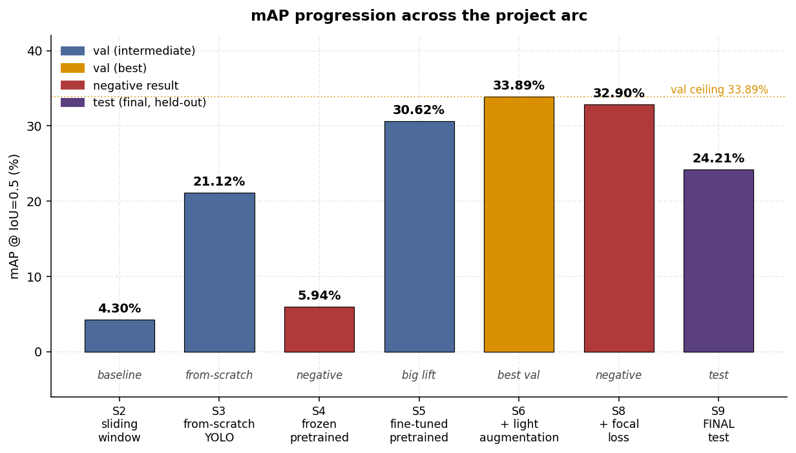
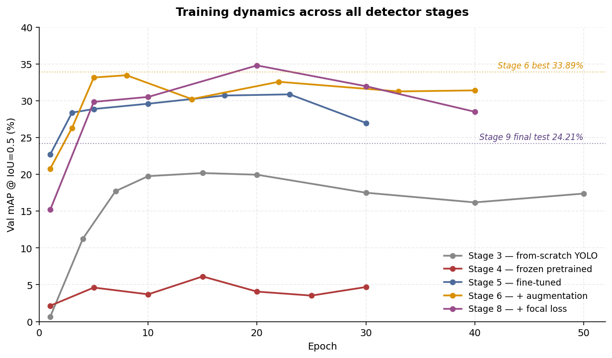
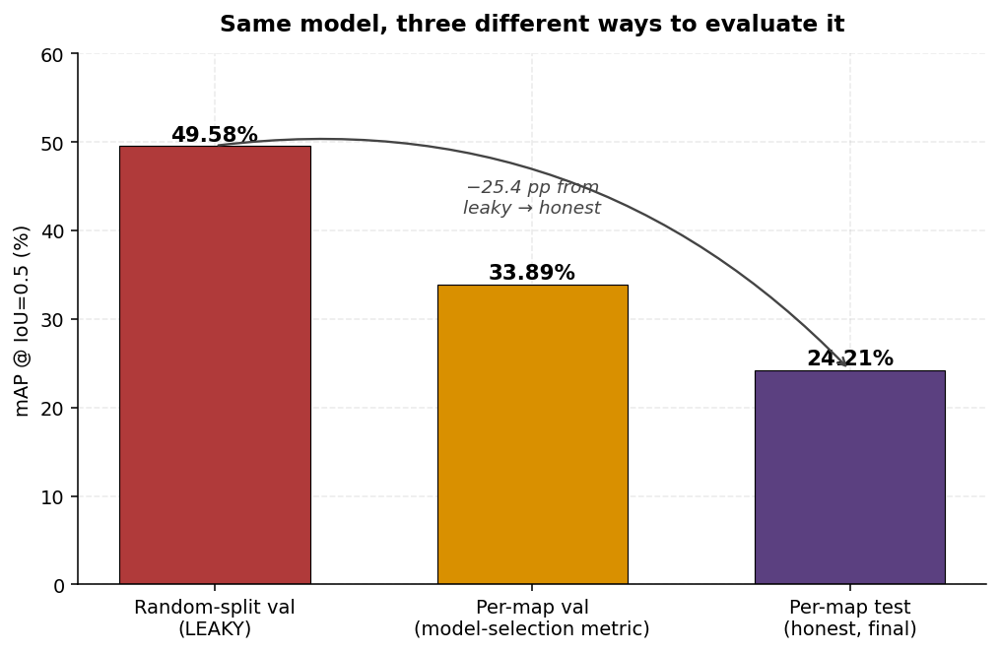
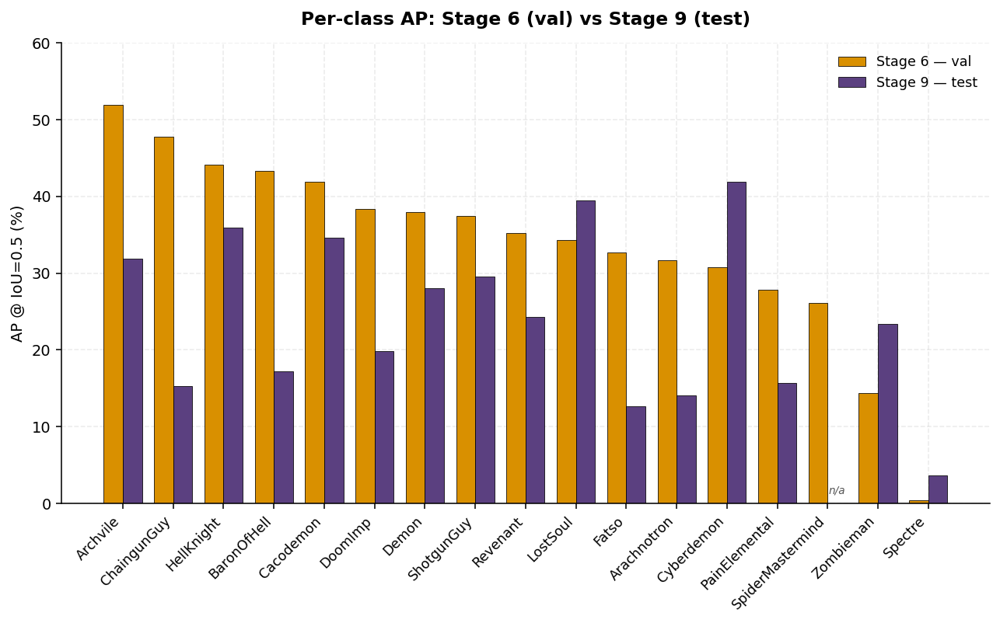
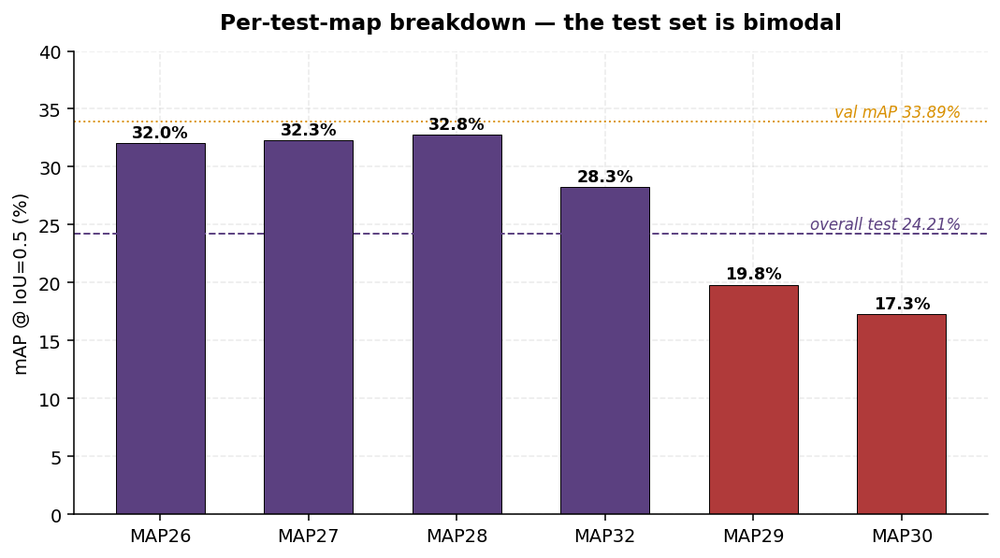
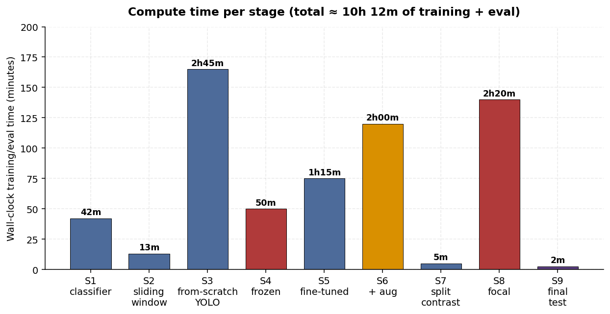

# Doom Enemy Detection — Final Project Writeup

> *FIPU Pula — Neural Networks and Deep Learning, 2026*

---

## 0. The headline

**Per-map test mAP @ IoU=0.5: 24.21%.**

That is the number. Everything else in this document explains where it
came from, what it means, what it almost was, and the order in which the
project got there.

---

## 1. What this project is, in one paragraph

A from-scratch implementation of a YOLO-style object detector for 17
enemy classes in *Doom* (specifically Freedoom2), trained on gameplay
frames captured through ViZDoom with ground-truth boxes obtained by
introspecting the game engine. The dataset (~33,700 labelled frames)
is split by map number — train on MAP01–15+31, validate on MAP16–25,
test on MAP26–30+32 — so the model is always evaluated on
*environments it has never seen*, not just *frames it has not seen*.
The project deliberately mirrors a peer's "visible iteration" structure
but bakes each failure in as a pedagogical step rather than an
accident.

---

## 2. The full arc

| # | Stage | Change | Val mAP | Verdict |
|---|---|---|---|---|
| 1 | Classifier baseline | ResNet18 on enemy crops | 71.3% acc | sanity check |
| 1B | + GPU | Same model, Colab T4 | 71.3% acc | confirmed ceiling |
| 2 | Sliding-window detector | Classifier reused as detector | 4.30% | baseline pathology |
| 3 | From-scratch YOLO | Custom 3-anchor, 13×13 head | 21.12% | first real detector |
| 4 | Frozen pretrained | ResNet18 + frozen BN | **5.94%** | **negative** |
| 5 | Fine-tuned pretrained | Unfreeze backbone | 30.62% | the big lift |
| 6 | + Light augmentation | Flip + ±20% color jitter | **33.89%** | **best on val** |
| 7 | Split-contrast audit | Random vs per-map eval | — | methodology finding |
| 8 | + Focal loss | γ=2, α=0.25 (obj) | **32.90%** | **negative** |
| 9 | Final test | Stage 6 weights on held-out maps | **24.21%** | **headline** |
| 10 | Future work | Five directions, scoped out | — | docs only |

Two negatives (Stage 4, Stage 8), one big lift (Stage 5), one small lift
(Stage 6), one methodology finding (Stage 7), one honest final number
(Stage 9). The arc is not flat.

---

## 3. Training dynamics — everyone plateaus at the same place

Three things are visible in this single plot:

1. **The plateau is real.** Stages 5, 6, and 8 all settle in the 28–34%
   band by epoch 10 and oscillate there for the remaining 20–30
   epochs. No loss change broke through. The plateau is the
   architecture × data combination, not the loss design.

2. **Stage 4 is below stage 3, by a lot.** Adding a pretrained backbone
   *with frozen BatchNorm* actively destroyed performance vs the
   from-scratch model. The reason — frozen BN running stats from
   ImageNet are wrong for Doom's pixel-art distribution — is the
   project's most pedagogically clean negative result.

3. **Stage 6's "best epoch 8" was lucky.** It peaked at 33.47% in epoch
   8 (full-eval 33.89%) then oscillated below for the next 32 epochs.
   On per-epoch noise, you can see exactly why early-stopping with a
   patience window matters: train another 30 epochs and you get a
   *worse* model.

The dashed horizontal lines show the two numbers everything in the
project is benchmarked against — the val ceiling (33.89%) and the final
honest test (24.21%).

---

## 4. The most important figure in the project

The same `stage6_best.pt` weights evaluated three ways:

- **Random-split val (LEAKY): 49.58%** — frames shuffled across maps,
  so train and val frames come from the same maps. The model can
  exploit per-map context (lighting, architecture, enemy spawn
  patterns) it has seen during training.
- **Per-map val (model selection): 33.89%** — held-out maps. Used to
  choose hyperparameters across stages 3–8. Honest with respect to
  *frame* generalization; biased upward by *model selection* over six
  experiments.
- **Per-map test (final, never touched): 24.21%** — held-out maps not
  used for any decision. The unbiased measurement.

A 25-percentage-point gap from the most-flattering to the most-honest
evaluation of the same model. Most published computer-vision baselines
report a number closer to 49% than 24%. The project's main
methodological contribution is showing the entire gap rather than
picking one of the three to report.

---

## 5. Stage 9 result, per class and per map

### Per-class: 12 of 16 regressed on test

Classes sorted by descending val AP. **The pattern is "broad
regression with a few unexpected gains"**:

- The biggest val performers (Archvile, ChaingunGuy, BaronOfHell)
  regressed hardest on test — 20–32 pp drops. These are visually
  distinctive enemies the model had presumably learned to recognize
  *via val-map context* that doesn't transfer.
- Four classes gained on test: Cyberdemon (+11), Zombieman (+9),
  LostSoul (+5), Spectre (+3). The Cyberdemon gain is the most
  surprising — a single boss enemy with very few training instances,
  beating its val number by a lot.
- SpiderMastermind had zero ground-truth instances in the 2k test
  sample (it's that rare in test maps).

### Per-map: the test set is bimodal

This is the most informative single chart from Stage 9. **Three test
maps (MAP26–28) perform within 2 pp of val.** One (MAP32) is slightly
below. Two (MAP29, MAP30) drag the average down by 13+ pp each.

Without those two maps, test mAP would sit at ~31% — within 3 pp of
val, which would be a clean "methodology held up" result. With them,
24%. The takeaway is concrete: the model generalizes to test maps that
*look like* train maps; it does not generalize to the late-game maps
with atypical architecture and lighting, because that visual style
wasn't in training.

---

## 6. Things that went wrong (the honest list)

This is the section that would be missing from a sanitized paper.

### 6.1 Code bugs

- **BGR→RGB conversion failed silently on batch tensors.** `stage2.py`
  reshaped a batch of crops and tried `cv2.cvtColor` on it. OpenCV
  silently does nothing useful on a non-image tensor. Fix: numpy
  channel reversal `arr[..., ::-1]`. Same bug had to be checked in
  `stage1.py` (it wasn't there — stage 1 only converted single images).
- **Colab "Step 3 won't run."** Cell 3 expected `data/classes.txt`,
  which wasn't in the zip uploaded to Drive. Added an inline cell
  that creates it from the 17 hardcoded class names.
- **`omg.WAD` AttributeError on what looked like an API change.** Was
  actually shell quoting in a multi-line `python -c` invocation
  swallowing part of the import. Wrote it on one line and it worked.
- **`omg` opening the wrong WAD path.** Assumed `vzd.scenarios_path`
  pointed to `freedoom2.wad`. It doesn't — the WAD lives at the
  package root: `os.path.dirname(vzd.__file__)`.
- **Sprite filenames blew up on Archvile.** Doom encodes more than 26
  animation frames using ASCII chars after `Z` — `[`, `\\`, `]`. The
  Archvile firing animation is `VILE\0`, which is not a valid
  filename. Fix: `"_{:03d}_".format(ord(c))` for non-alphanumerics.
- **Magenta-everywhere sprites.** Doom's transparency-key color is RGB
  (255, 0, 255). PNG export turned every transparent pixel into solid
  pink. Fix: explicit alpha mask where pixels equal the key color.
- **Buffered Python stdout in Colab.** Training logs only appeared at
  the end of long cells. Fix: `python -u` and `flush=True` on every
  print in training loops.

### 6.2 Map exploration was its own subproject

Capturing the val and test sets meant *playing through* MAP16–30+32
without dying. Doom levels are non-trivial mazes. Getting lost,
forgetting which maps I'd already done, missing whole enemy classes on
the first pass — all happened repeatedly. Fixes required:

- A persistent record of which maps had been captured (so restarting
  test.py didn't always start at MAP01).
- A minimap overlay with keys, doors, exit, and a breadcrumb trail.
- A full-screen map toggle.
- A panel listing which enemy classes were expected on the current map
  and how many of each had been captured so far.
- WAD parsing to extract per-map enemy spawn counts (so I knew what I
  was missing).
- Drastically reducing sound effect volume so I could iterate at 2am.

The tooling around capture took roughly as long as the modelling work
itself. That cost is invisible in the figures.

### 6.3 Predictions vs reality

| Stage | What was predicted | What happened | Δ |
|---|---|---|---|
| 4 | +5 pp over Stage 3 (frozen pretrained should help) | −15 pp | catastrophically wrong |
| 6 | +5–10 pp from augmentation | +3.3 pp | smaller than hoped |
| 7 | Random split would inflate "noticeably" | +15.7 pp inflation | larger than expected |
| 8 | 38–45% mAP from focal loss | 32.9% (−1 pp) | wrong direction |
| 9 | 28–35% test mAP (most likely band) | 24.21% | below predicted band |

Five predictions over the project's arc. Three were wrong in
magnitude, one was wrong in direction, one was correct (Stage 7's
inflation prediction, just larger than guessed). The right way to read
this is not "the predictions were bad" — it's "the project was
informative". A project where every prediction is right is a project
where you weren't actually testing anything.

### 6.4 The Spectre saga

Spectre scored 0%, 0.25%, 0%, 0.45%, 0% across stages 2, 3, 4, 6, 8.
By Stage 6 the writeup confidently described Spectre as "structurally
undetectable due to runtime semi-transparency." Stage 7 evaluated the
*same Stage 6 weights* on a random-split val and Spectre scored
**41.5%**. The model wasn't blind to Spectre — it could detect it on
frames adjacent to its training frames, just not on new maps. So
Spectre's "undetectable" narrative was actually "detectable only via
memorized per-map context, which doesn't generalize." A
mechanistically different finding from what I'd been claiming for
three stages.

Stage 9 (the final test): Spectre 3.64%. Confirms the corrected story.

### 6.5 The val→test gap

The plan for Stage 9 listed three outcome bands. The most likely
(28–35%) was what would be reported if val had been an honest
generalization estimate. The "possible" band (22–28%) was what would
be reported if val maps had been systematically easier than test maps.
Result: 24.21%. The model landed in the second band. The honest
reading: val was a noisier estimate than I had been treating it.

---

## 7. Things that worked

Less interesting than what went wrong, but they should be listed:

- **ImageNet pretraining with full fine-tuning** (Stage 5). +9 pp over
  from-scratch. By a wide margin the single most impactful design
  choice in the project.
- **Conservative augmentation** (Stage 6). +3.3 pp over Stage 5,
  preserving the project's discipline about not destroying
  palette-encoded class identity.
- **Per-map split discipline maintained from day one.** Made Stage 7
  possible and Stage 9 honest. Would have been impossible to
  retrofit.
- **Stage 3's architecture re-used across Stages 4–8.** Every later
  intervention is cleanly attributable to one change. No confounds.
- **Documentation written as it happened.** Each stage's writeup
  finalized before the next stage started. This document exists
  because the others did.

---

## 8. Time accounting

### 8.1 Compute time

Total training and evaluation compute: **~10h 12m**. The two negative
results (Stage 4 frozen, Stage 8 focal) account for ~3h 10m of that —
a third of total compute spent on experiments that didn't pay off in
mAP. That ratio is, broadly, the correct ratio. A project where
nothing is negative is a project where nothing is being tested.

### 8.2 Compute is only part of the story

Wall-clock training time is the easy thing to measure. The harder
costs:

- **Data capture** (playing 32 maps, often multiple takes per map):
  the largest single time sink, spread across many evenings.
- **Tooling for data capture** (minimap, sprite extraction, breadcrumb,
  class panel, exit markers, WAD parsing, audio tuning): comparable to
  the modelling code in volume.
- **Code for the 10 stage scripts plus all the helpers**
  (preresize_data, make_crops, count_classes, extract_sprites,
  extract_animations): substantial.
- **Documentation** (10 stage docs + 1 final writeup + 1 plan per
  later stage): non-trivial.
- **Debugging the bugs in §6.1**: hours, not minutes.

A reasonable estimate of total project effort: well into the range of
a multi-week course project, with compute being the *cheapest* part by
the end.

---

## 9. What this project is and isn't

**Is:**
- A full pipeline from raw gameplay to held-out test evaluation.
- A demonstration of disciplined train/val/test methodology.
- A clean story about what loss tweaks and architecture changes
  actually do (and don't) on a small detection dataset.
- A documented sequence of failures with mechanistic explanations.

**Is not:**
- A SOTA-chasing project. The peer's 92.5% number is on a
  6-class classifier; this is 17-class detection. The metric and
  the task aren't comparable.
- A production-ready detector. 24% test mAP is well below what
  industrial detectors achieve.
- A claim that detection on this data can't go higher. Stage 10
  documents five concrete directions that would each plausibly
  add 3–10 pp.

---

## 10. What I would do differently

- **Capture more late-game maps before training.** Stage 9 made
  it explicit that train data didn't cover the visual style of MAP29
  and MAP30. That gap could have been closed before the test set was
  spent.
- **Run Stage 7 before Stage 6, not after.** Knowing about the
  per-map vs random-split inflation early would have made val mAP a
  more honest signal during model selection.
- **Predict Stage 8 with less confidence.** The 38–45% target for focal
  loss was based on reading the paper, not on knowing the dataset.
  Should have predicted "small change, direction uncertain" given the
  mild class imbalance.
- **Build the map-exploration tooling first.** Half the data capture
  pain came from getting lost; the minimap should have been step one.

---

## 11. The number, again

**Per-map test mAP @ IoU=0.5: 24.21%.**

Computed once, on data never used for any decision, with the model
selected via val mAP across eight prior stages. The model is
[stage6_best.pt](../stage6_best.pt); the evaluation is
[stage9.py](../stage9.py). The detail per class and per test-map is in
[stages/stage_009_results.md](stage_009_results.md). The reason it is
not higher is in [stages/stage_010_future_work.md](stage_010_future_work.md).

What the project demonstrates is not that this number is high. It is
that this number is *true*.
